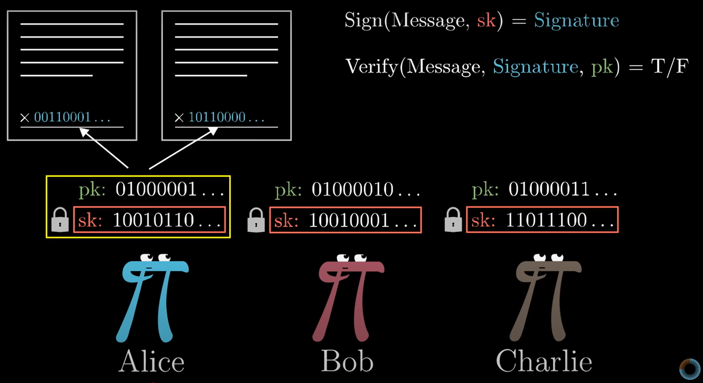
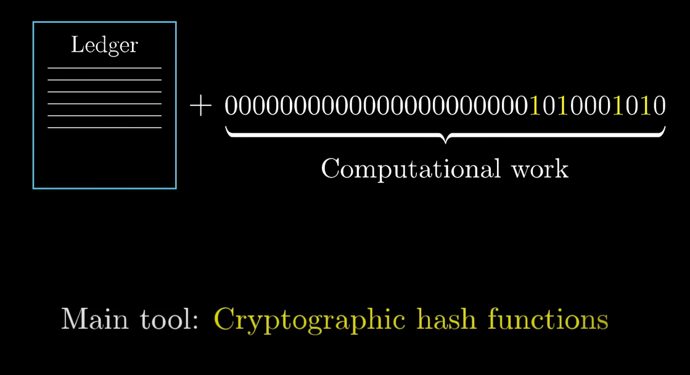
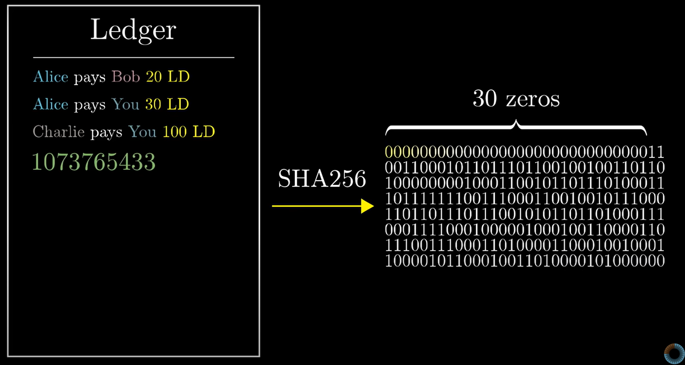

# Bitcoin Explained - README

## Introduction
Bitcoin is a decentralized digital currency that operates without a central authority. It was created by **Satoshi Nakamoto** (supposedly) in 2009 as an alternative to traditional financial systems. Unlike fiat currencies, Bitcoin is based on blockchain technology and operates on a peer-to-peer network.

Bitcoin functions as a **decentralized ledger** where transactions are updated by participants and must be reflected correctly for all. The main challenge in this system is ensuring **security and consensus**, which is achieved through:

---

## a. Digital Signatures

  
(credits: 3Blue1Brown)

Each transaction is **digitally signed** using a **private key** (can be handled by you by storing it in a harddrive, etc.. or can be handled by wallets like coinbase). This ensures that only the rightful owner can authorize a transaction. The public key allows others to **verify** the transaction's authenticity. Each ledger entry can include a unique serial number to prevent duplication.

---

## b. Cryptographic Hash Functions (SHA-256)

Another challenge is ensuring that all participants have **identical copies of the ledger**. 

  
(credits: 3Blue1Brown)

To maintain ledger consistency, Bitcoin employs a **proof-of-work system** where miners solve cryptographic puzzles using the SHA-256 algorithm. 

  
(credits: 3Blue1Brown)

### How Mining Works
1. The SHA-256 algorithm requires miners to find a **valid hash** with a specified number of leading zeros (e.g., 30 zeros).
2. Miners **try different numbers (nonces)**, such as `1073765433`, to see which input produces the required hash.
3. Since SHA-256 is a one-way function, even a tiny change in the input drastically changes the hash, making it a computationally **difficult problem** to solve.
4. The first miner to find a valid hash **adds the new block** to the blockchain.
5. People can use this block for verified transaction through them. (This is also verifying thorugh this block takes ~10mins for bitcoins --> Solved by etherium)
6. The miner receives a reward in **Bitcoin**, which is how new BTC enters circulation.
7. Since Bitcoin has a fixed cap of **21 million coins**, its scarcity makes it more valuable (similar to gold). 

Currently, **1 BTC ≈ $98,000 USD** and **1 BTC = 100M Satoshis**.

---

## 1. Do We Need to Mine to Get Bitcoins?
**No, mining is not the only way to acquire Bitcoin.** You can also:
- Buy Bitcoin from exchanges.
- Receive Bitcoin as payment for goods or services.
- Trade Bitcoin with others.
- Earn Bitcoin through rewards and incentives.

However, mining is **essential for the network** as it validates transactions and secures the blockchain.

---

## 2. Bitcoin as an Asset vs. a Currency
While Bitcoin was originally designed to function as a **digital currency**, it is primarily used today as a **store of value** (similar to gold) rather than for daily transactions.

### **Why is Bitcoin Used as an Asset?**
- **High Volatility**: Frequent price swings make it difficult to use as a stable currency.
- **Slow Transaction Times**: Compared to traditional payment methods, Bitcoin transactions take longer to confirm.
- **Scarcity**: With only **21 million BTC**, many investors see Bitcoin as a **long-term investment** rather than everyday money.

### **What is the Use of Buying Bitcoin?**
- **Investment**: Many people buy Bitcoin as a hedge against inflation.
- **Decentralized Finance (DeFi)**: Some platforms allow users to stake or lend Bitcoin for passive income.
- **NFTs & Crypto Art**: Bitcoin isn't commonly used for NFTs, but blockchain technology enables digital ownership of assets (Ethereum is more dominant here).
- **Borderless Payments**: Bitcoin enables fast international transactions without the need for intermediaries.

While Bitcoin is not widely used for daily transactions yet, **Layer 2 solutions** (like the Lightning Network) aim to improve speed and lower transaction fees.

---

## 3. Why Is Bitcoin Limited to 21 Million Coins?
The 21 million limit was set by **Satoshi Nakamoto** to prevent inflation. Unlike fiat currencies that can be printed endlessly, Bitcoin’s fixed supply makes it **more like digital gold**.

### Why a Limit?
- Prevents **devaluation** due to excessive supply.
- Ensures **scarcity**, increasing demand and value over time.
- Protects against **government manipulation** of the currency.

Despite the limit, **Bitcoin is divisible**, meaning small fractions (satoshis) can still be used for transactions.

---

## 4. Bitcoin vs. Ethereum vs. Other Cryptocurrencies

### **Bitcoin vs. Ethereum**
| Feature           | Bitcoin (BTC)  | Ethereum (ETH)  |
|------------------|---------------|----------------|
| Purpose         | Digital Gold, Store of Value | Smart Contracts, dApps |
| Supply Limit    | 21 Million BTC | No Fixed Limit |
| Consensus Mechanism | Proof-of-Work (PoW) | Transitioning to Proof-of-Stake (PoS) |
| Transaction Speed | ~10 min per block | ~15 sec per block |
| Smart Contracts | No | Yes |

### **Bitcoin vs. Other Cryptos**
- **Litecoin (LTC)**: Faster version of Bitcoin with 2.5-minute blocks.
- **Ripple (XRP)**: Centralized for fast bank transactions.
- **Cardano (ADA)**: Uses PoS for better efficiency.

---

## 5. Conclusion
Bitcoin is a revolutionary technology that challenges the traditional financial system. While it faces **scalability, volatility, and adoption challenges**, it is also seen as a **digital store of value** and a **potential global financial asset**.

**What’s Next?**
- Faster & cheaper transactions (Lightning Network).
- Government-backed Bitcoin alternatives (CBDCs & stablecoins).
- Wider adoption as a **store of value or global reserve currency**.

Bitcoin may not **replace fiat** anytime soon, but it has already changed the way people think about money. 🚀🔗